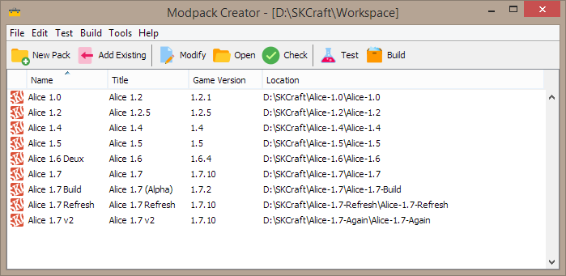
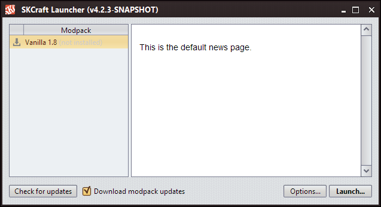
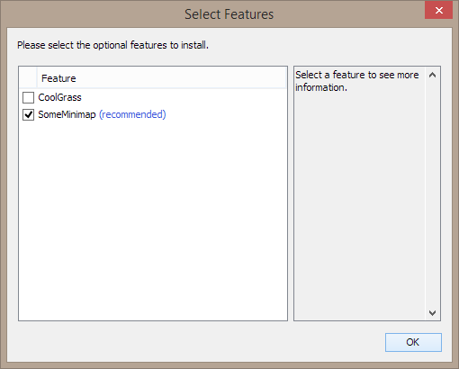
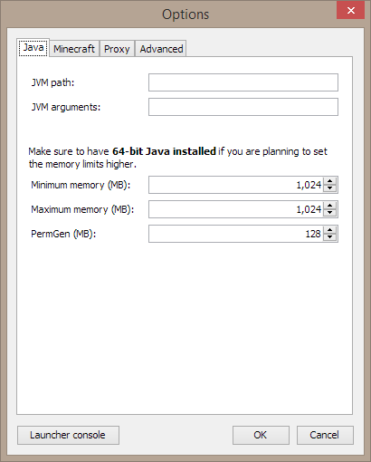
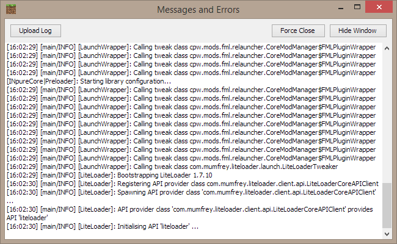
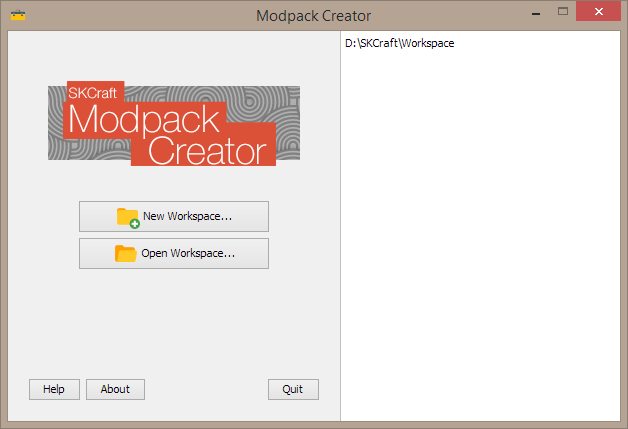

SKCraft Launcher
================

SKCraft Launcher provides a platform for creating, testing, and distributing modpacks for groups of all sizes. It 100% open source and works on Windows, Mac OS X and Linux/BSD.

With this platform, you have **full control** of the modpacks that you choose to release.

Every other launcher platform either requires you to maintain cryptic JSON/XML files (error prone and a lot of extra work), requires distributing a .zip of your modpack (therefore not supporting delta downloads and wasting disk space), or requires a complicated server setup where you have to install certain software on your server. In our case, we **(1)** threw away any need for JSON/XML files when making modpacks, **(2)** don't require a .zip and yet still can support delta downloads and **(3)** require absolutely zero server setup (if you only know FTP, that's enough).

What to be aware of? You'll probably need a few hours to get everything working. Fortunately, we have a [detailed wiki](https://github.com/SKCraft/Launcher/wiki) with screenshots for every step, intended for someone with minimal technical experience.

### Features

* No XML/JSON files involved to create or update a modpack
* Create a modpack by dragging and dropping mod .jars into a mods/ folder
* Support for LiteLoader, Forge, and JAR mods
* Support for resource packs
* Support for all and any modpack files
* Test modpacks without even needing a separate launcher
* Multiple modpacks in the launcher
* Deduplication of files (only upload a mod once for all modpacks)
* Delta downloads when updating (only changed files)
* Download resume
* No need to host old versions; users can update from any previous version
* No PHP or complex server setup necessary
* Compatible with all standard website hosting and CDNs
* Optional mods/files support
* Support for default configuration files
* Modpack-specific Java flags
* "Hidden" modpacks that require a special access key (this *does* require PHP support)

The wiki provides a detailed tutorial for configuring the launcher. You will need a website or an older Dropbox account to host your modpack's files, but there are several free website hosting options (with PHP support) listed on the wiki (with tutorials).

### Making Modpacks

Making modpacks is extremely easy: you can use our modpack creator tools:

If installing mods for your own game only requires putting a .jar file into a mods folder, why should making a modpack be any harder?

To get started, you just make a folder that looks like your Minecraft installation folder:

* src/**config**/
* src/**mods**/
* src/**resourcepacks**/
* loaders/

Support for Minecraft Forge and LiteLoader merely involves putting their installer .jars into the loaders folder.

### Great Client

The launcher has a beautiful dark UI that's elegant and easy to use (although a native UI is also available). Display your own webpages so users always know what's up when they start the game.

When it comes to launching your modpacks, users can start, abort, and resume updates at any time. Files are downloaded in parallel, and the launcher knows how to handle the removal of files from the modpack.

Users can select those optional features that you have added:

The launcher can **even update itself**.

...and you can use it in portable mode too.

### More Features

All of the modpack tools can be used to create a server modpack alongside the client modpack!

You can optionally use **command line tools** only, without the GUI entirely. Combine the launcher with Git and Jenkins (or whatever you prefer) to automatically build modpack releases when you push a new version.

### History

The launcher has been in development since the early days of Minecraft Alpha. It has powered and always has powered sk89q's own server, SKCraft.

[The older 3.x version was can be found elsewhere](https://github.com/sk89q/SKMCLauncher).

## Additional Screenshots

You can also use the "plain" version of the launcher:

More of the Modpack Creator:

## Getting Started

* [Read the wiki](https://github.com/SKCraft/Launcher/wiki)
* [Forum to ask for help](http://forum.enginehub.org/forums/launcher.25/)
* [Join us on IRC: #sklauncher on EsperNet (irc.esper.net)](https://webchat.esper.net/?channels=sklauncher)

If you find the launcher useful, you can [support me on Patreon](https://www.patreon.com/sk89q).

## Compiling

In your command prompt or terminal, run:

	./gradlew clean build

If you are on Windows:

	gradlew clean build

If you wish to import the project into an IDE, you must add support for Project Lombok (IntelliJ IDEA users: also enable annotation processing in compiler settings).

## Contributing

Pull requests can be submitted on GitHub, but we will accept them at our discretion. Please note that your code must follow Oracle's Java Code Conventions.

Contributions by third parties must be dual licensed under the two licenses described within LICENSE.txt (GNU Lesser General Public License, version 3, and the 3-clause BSD license).

## License

The launcher is licensed under the GNU Lesser General Public License, version 3.
