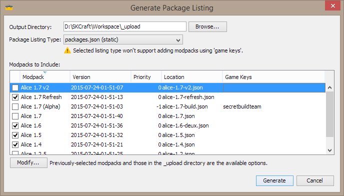

NoHope Launcher
================

The NoHopeLauncher is the minecraft launcher used for all the 360NoHope modpacks and servers.

## Getting Started

You'll probably need a few hours to get everything working. Fortunately, we have a [detailed wiki](https://github.com/SKCraft/Launcher/wiki) with screenshots for every step, intended for someone with minimal technical experience.

For your evaluation, there are sample files provided that you will be able to upload to your site to see if it even works for you.

## Pretty Pictures

If you are going to create modpacks with our GUI tool, you'll be seeing this beaut:

Making a modpack is just drag and drop into a folder like this:

* src/**config**/
* src/**mods**/
* src/**resourcepacks**/
* loaders/

LiteLoader and Forge installers, or Fabric Loader, go into the *loaders* folder. :ok_hand:

### More Pictures

There's a dark version of the launcher (personally not the creator's cup of tea) that you can use:

Users can select optional mods/features:

The launcher can update itself and you can use it in portable mode too.

### The Light Theme

## Contributing

Pull requests can be submitted on GitHub, but we will accept them at our discretion. Please note that your code must follow Oracle's Java Code Conventions.

Contributions by third parties must be dual licensed under the two licenses described within LICENSE.txt (GNU Lesser General Public License, version 3, and the 3-clause BSD license).

## License

The launcher is licensed under the GNU Lesser General Public License, version 3.
