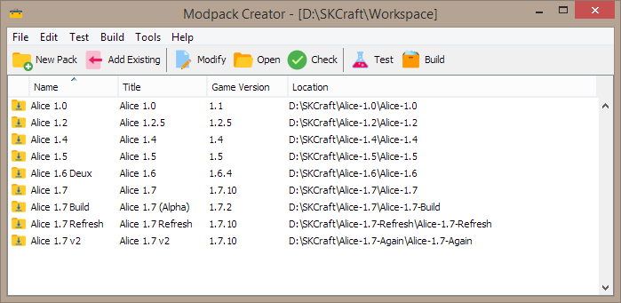

SKCraft Launcher
================

*If you rely on this software, please consider [donating](https://liberapay.com/offbeatwitch/donate) to help keep it maintained!*

Need to make it easy for people to install and play your modpack? The SKCraft Launcher platform may be for you if:

:heavy_check_mark: You want your own logo and branding on the launcher, with your own news feed  
:heavy_check_mark: You want to be able to update the modpack whenever you want  
:heavy_check_mark: You don't want to depend on anyone else  
:heavy_check_mark: There's several modpacks you want to provide as a set  
:heavy_check_mark: You want to provide 'hidden' modpacks that are only accessible by a secret code

It may not be for you if:

:small_orange_diamond: You made a cool modpack and you just want it out there  
:small_orange_diamond: You don't have a website or place for people to download files from  
:small_orange_diamond: You don't want anything to do with distributing the launcher

## What We Do Right

Creating modpacks with this launcher is super easy: :one: only drag & drop of configs and mods into a folder, :two: ZERO! scary XML/JSON files to edit, and :three: there's a nice interface for creating modpacks (command-line is also available).

The launcher has all standard features that you'd expect like :one: resume of incomplete downloads, :two: incremental updates, and :three: file deduplication (saves disk space when you have files duplicated between updates or modpacks).

LiteLoader, Forge, Fabric, and custom .jar mods are supported. You can put resource packs in, or really even random mod files that don't go in the configs or mods folder.

You do need some sort of website, but it does **not** need anything complicated like PHP.

For those technically inclined, you can generate modpacks from Git (or any VCS) using your favorite continuous integration server, and then dynamically create modpacks even down to one per branch or tag.

Best of all, our launcher is Minecraft's oldest surviving modpack launcher platform. :thumbsup:

## Getting Started

You'll probably need a few hours to get everything working. Fortunately, we have a [detailed wiki](https://github.com/SKCraft/Launcher/wiki) with screenshots for every step, intended for someone with minimal technical experience.

For your evaluation, there are sample files provided that you will be able to upload to your site to see if it even works for you.

## Pretty Pictures

If you are going to create modpacks with our GUI tool, you'll be seeing this beaut:

Making a modpack is just drag and drop into a folder like this:

* src/**config**/
* src/**mods**/
* src/**resourcepacks**/
* loaders/

LiteLoader and Forge installers, or Fabric Loader, go into the *loaders* folder. :ok_hand:

### More Pictures

There's a dark version of the launcher (personally not the creator's cup of tea) that you can use:

Users can select optional mods/features:

The launcher can update itself and you can use it in portable mode too.

### The Light Theme

## Contributing

Pull requests can be submitted on GitHub, but we will accept them at our discretion. Please note that your code must follow Oracle's Java Code Conventions.

Contributions by third parties must be dual licensed under the two licenses described within LICENSE.txt (GNU Lesser General Public License, version 3, and the 3-clause BSD license).

## License

The launcher is licensed under the GNU Lesser General Public License, version 3.
